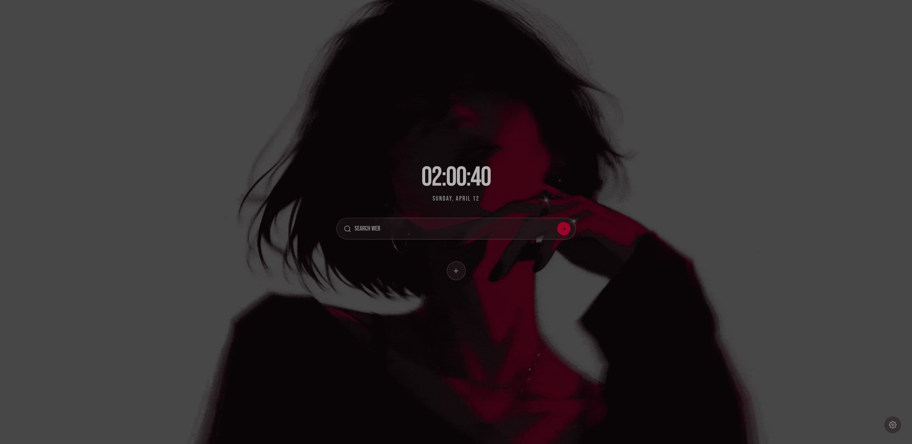

  <h1>Nozy-NT </h1>
  
  
<b>N</b>ice C<b>ozy</b> <b>N</b>ew <b>T</b>ab is a highly customizable minimalist new tab extension for chrome

## Install
- Click to download the extension: 
- Unzip it.
- Head to `chrome://extensions` and enable developer mode.
- Click load unpacked and select the unzipped folder.

## Customizations
Best way to explore the customizations is by downloading the extension and heading to the settings panel by clicking the settings icon at the bottom right corner. However if you are more of a text person below are the list of things that can be customized.

- General
    - Tab name
    - Tab favicon
    - Toggle on/off favorites
- Search
    - Search url: Uses `https://search.mydomain.com/?q={query}` format. As long as your url is syntactically valid and has the `{query}` identifier in it, you can use anything.
    - Search bar width
    - Search bar postion in x,y coordinates (adjusted via sliders. has limitations in freedom).
- Background
    - Colored background (disable background image)
    - Background image via either local file or url
    - Background image quality cap (in which resolution the background image should be saved. recommended is `1080p`)
- Theme
    - Enable themes: This unlocks custom themes. Click on "Browse Themes" to explore themes
    - Background color
    - Text color
    - Highlight color
    - Export current theme (little download icon next to extension name. only appears if any changes has been made to the current theme)
- Clock
    - Hide clock
    - Hide date
    - Clock size
    - Clock postion in x,y coordinates (adjusted via sliders. has limitations in freedom).
- Font
    - Font change using url and font family fields (same as you'd do in css)

## Theming
This extension supports theming via [theming API](/themes/README.md). It comes with set of themes made by me which will be shown under "Included" section in theme browser panel. See all available themes [here](/themes/included_themes.json)

To install community themes:
 - Move the theme folder starting with "nnt-" prefix inside the `themes` directory.
 - Add entry to it via `themes/community_themes.json`.
 - Enable custom themes inside the "Browse Themes" panel.

See more info [here](/themes/README.md).

## Warning
This entire extension has been fully vibe-coded using [copilot](https://github.com/apps/copilot-swe-agent) via heavily guided specific prompts.
Use it at your own risk.
